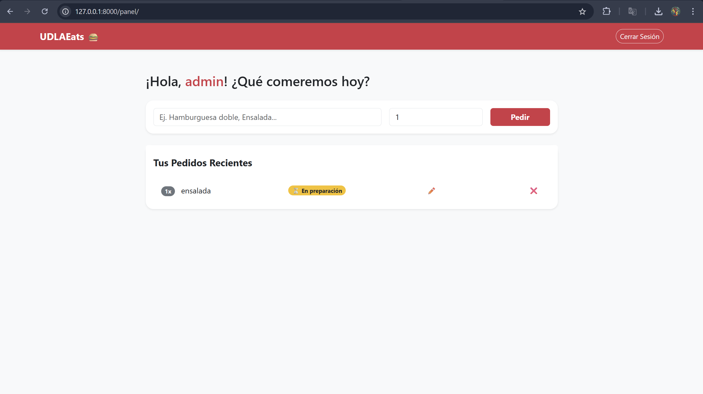

# 🍔 UDLAEats - Sistema de Gestión de Pedidos

UDLAEats es una aplicación web de delivery interno diseñada para la comunidad de la Universidad de las Américas (UDLA). Este proyecto demuestra la implementación de una arquitectura robusta, un sistema de seguridad por autenticación y un ciclo completo de gestión de datos (CRUD).

## 📋 Descripción del Proyecto

El objetivo es agilizar el proceso de pedidos en las cafeterías del campus. La aplicación permite a los estudiantes registrarse, iniciar sesión de forma segura y gestionar sus pedidos de comida en tiempo real.

Este desarrollo cumple con los requisitos de la Tarea 3 del séptimo semestre, enfocándose en:

1. **Arquitectura MVC:** Separación clara entre Modelos (datos), Vistas (interfaz) y Controladores (lógica).
2. **Clean Code:** Código legible, nombres descriptivos y funciones de responsabilidad única.
3. **Seguridad:** Protección de rutas mediante decoradores de autenticación.

## ✨ Características (CRUD & Login)

* **Autenticación:** Sistema de Login/Logout que protege el acceso a la gestión de pedidos.
* **Crear (Create):** Formulario dinámico para realizar pedidos (Platillo y Cantidad).
* **Leer (Read):** Visualización del historial de pedidos del usuario autenticado.
* **Actualizar (Update):** Edición de pedidos existentes para corregir datos.
* **Eliminar (Delete):** Cancelación de pedidos directamente desde la interfaz.

## 🛠️ Tecnologías

* **Lenguaje:** Python 3.x
* **Framework:** Django 
* **Frontend:** Bootstrap 5 (Diseño Responsivo)
* **Base de Datos:** SQLite

## 🚀 Instalación y Uso Local

Sigue estos pasos para ejecutar el proyecto en tu entorno:

1. **Clonar el proyecto:**
git clone https://github.com/JuanAntamba/7mo-Semestre_Tarea-3-Crud-Login.git
cd 7mo-Semestre_Tarea-3-Crud-Login

2. **Configurar el entorno:**
python -m venv venv
venv\Scripts\activate

3. **Instalar dependencias y preparar DB:**
pip install django
python manage.py migrate

4. **Crear Usuario de Acceso (Importante):**
Para poder probar el sistema de Login y el CRUD, es necesario crear un usuario administrador:
python manage.py createsuperuser

5. **Correr la aplicación:**
python manage.py runserver

Acceder en: http://127.0.0.1:8000/cuentas/login/

---
**Autor:** Juan Carlos Antamba  
**Institución:** Universidad de las Américas (UDLA)